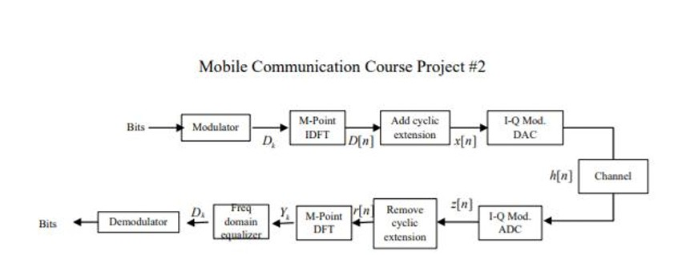

# 📡 Mobile Communication Course Project #2

## 系統架構介紹

以下為本專案的 **OFDM 收發機 (Transceiver)** 系統架構圖：  



---

### 🔼 發射端 (Transmitter)

1. **Modulator**  
   - 將輸入的 bits 調變為 BPSK 符號：
 
$$
D_k \in \{-1, +1\}
$$  

2. **M-Point IDFT (IFFT)**  
   - 將頻域符號轉換至時域，得到 $D[n]$。  
   - 目的：讓多個子載波保持正交，避免干擾。  

3. **Add cyclic extension (CP)**  
   - 在符號前加上循環字首 (Cyclic Prefix)，形成 $x[n]$。  
   - 功能：將通道中的「線性卷積」轉為「循環卷積」，抵抗符號間干擾 (ISI)。  

4. **I-Q Mod. DAC**  
   - 轉換為 I/Q 類比訊號（模擬中可省略）。  

5. **Channel $h[n]$**  
   - 模擬無線通道效應，包括多路徑衰落與加性白雜訊 (AWGN)。  

---

### 🔽 接收端 (Receiver)

1. **I-Q Mod. ADC**  
   - 將類比訊號轉回數位訊號，得到受通道影響的 $z[n]$。  

2. **Remove cyclic extension**  
   - 去掉循環字首，還原有效的 OFDM 符號，得到 $r[n]$。  

3. **M-Point DFT (FFT)**  
   - 將時域訊號轉回頻域，得到：
    
$$
Y_k = H_k D_k + N_k
$$  

4. **Frequency domain equalizer**  
   - 使用 Zero-Forcing 等化器：
   
$$
\hat{D}_k = \frac{Y_k}{H_k}
$$  

   - 目的：補償通道的增益與相位失真。  

5. **Demodulator**  
   - 將等化後的符號 $\hat{D}_k$ 判決回原始 bits。  

---
## Code

```matlab
%% ==================== OFDM System Simulation (BPSK) ==================== %%
clear all; close all; clc;

%% -------------------- 系統參數設定 -------------------- %%
M       = 64;                % FFT 點數 (Number of FFT points)
sc      = 52;                % 資料子載波數 (Number of data sub-carriers)
ofdmbit = 52;                % 每個 OFDM symbol 的 bits 數 (這裡用 BPSK，所以 bits = sub-carrier 數)
Nsymbol = 100;               % 模擬 OFDM 符號數 (Number of OFDM symbols)

%% -------------------- BPSK 調變 -------------------- %%
Data   = randi([0,1], ofdmbit*Nsymbol, 1);   % 產生隨機位元資料 (0/1)
dk     = 2*Data - 1;                         % BPSK 調變: 0→-1, 1→+1
dk_sym = reshape(dk, sc, Nsymbol);           % 串列轉並列 (Serial → Parallel)

%% -------------------- 子載波配置 -------------------- %%
% OFDM 有 64 個子載波，其中：
%   - 使用 52 個做資料傳送
%   - 中間 DC (第33個) 不用
%   - 兩側 guard band 也不用
Dk = zeros(M, Nsymbol);
Dk(7:32, :)  = dk_sym(1:26, :);   % 左半部 26 個資料子載波
Dk(34:59, :) = dk_sym(27:52, :);  % 右半部 26 個資料子載波

%% -------------------- IFFT (轉到時域) -------------------- %%
IDFT = [];
for i = 1:Nsymbol
    IDFT = [IDFT ifft(Dk(:, i), M)];
end

%% -------------------- 加入循環字首 (Cyclic Prefix, CP) -------------------- %%
D_cp = zeros(M+16, Nsymbol);
D_cp(1:16, :)   = IDFT(49:64, :);   % 複製最後 16 點到前面
D_cp(17:80, :)  = IDFT(1:64, :);    % 原本的 64 點

%% -------------------- 通道模型 (多路徑衰落) -------------------- %%
% 定義一個多徑通道 impulse response
h = [0.5-0.5j  0  0.15+0.12j  0  0  -0.1+0.05j];

%% -------------------- 串列化並通過通道 -------------------- %%
x_n = reshape(D_cp, 1, (M+16)*Nsymbol);   % 並列轉串列
h_n = h ./ norm(h);                       % 通道正規化
xh  = conv(x_n, h_n);                     % 傳輸: x * h

%% -------------------- 加入 AWGN 雜訊 -------------------- %%
Eb_N0 = 20;                              % Eb/No (dB)
Eb    = mean(abs(x_n).^2);               % 計算平均 bit 能量
Np    = Eb * 10^(-(Eb_N0/10));           % 噪聲功率
znn   = xh(1:end-5);                     % 調整長度 (扣掉通道記憶)
z_n   = awgn(znn, 20, 'measured');       % 加入 AWGN

%% -------------------- 移除循環字首 (CP Removal) -------------------- %%
receiver = reshape(z_n, 80, Nsymbol);
rn       = receiver(17:end, :);   % 去掉前 16 點，只留 64 點

%% -------------------- FFT (轉回頻域) -------------------- %%
DFT = [];
for i = 1:Nsymbol
    DFT = [DFT fft(rn(:, i), M)];
end

%% -------------------- 移除虛零子載波 (刪掉 DC 與 Guard) -------------------- %%
Yk64 = [DFT(7:32, :) ; DFT(34:59, :)];
Yk52 = [Yk64(:,1).' Yk64(:,2).'].';   % 串列化
scatterplot(Yk52);
title('Constellation (Before Equalization)');

%% -------------------- Equalizer (通道補償) -------------------- %%
Hn = fft(h, M);   % 通道頻率響應
Dk = [];
for i = 1:Nsymbol
    Dk = [Dk DFT(:,i) ./ Hn.'];   % Z(k)/H(k)
end

%% -------------------- 還原資料子載波 -------------------- %%
Dkreceiver = [Dk(7:32, :) ; Dk(34:59, :)];   % 去掉不用的載波
Dkr        = reshape(Dkreceiver, 1, 52*Nsymbol);

scatterplot(Dkr(1, 1:104));
title('Constellation (After Equalization)');

```
---
## 1. OFDM 系統參數與公式說明

```matlab
M = 64;                 % FFT 點數
sc = 52;                % 資料子載波數
ofdm_bit = 52;          % 每個 OFDM symbol 的 bits 數 (BPSK = 52)
Nsymbol = 100;          % 模擬的 OFDM 符號數
cp_len = 16;            % 循環字首長度
```

---

### 1.1 FFT 點數 \$M = 64\$

在 OFDM 中，一個符號是透過 \$M\$ 點 IFFT 轉換成時域訊號。公式為：

$$
x[n] = \frac{1}{M} \sum_{k=0}^{M-1} D_k \, e^{j2\pi kn/M}, \quad n=0,1,\dots,M-1
$$

* **\$M=64\$** → 表示每個 OFDM 符號包含 **64 個子載波 (subcarriers)**。
* **\$D\_k\$** → 第 \$k\$ 個子載波上的符號。

#### 🔹 一個 OFDM Symbol 是什麼？

* **Symbol**：在數位通訊裡，symbol 指的是 **調變後的一個訊號單位**。

  * 例如：BPSK → 1 bit 對應 1 symbol。
  * QPSK → 2 bits 對應 1 symbol。
  * 16-QAM → 4 bits 對應 1 symbol。

* **在 OFDM 中**：
  一個 OFDM symbol 並不是單純的一個調變符號，而是 **一整個 IFFT 輸出的時域訊號 (長度 \$M\$)**。

  * 它由 \$M\$ 個子載波組合而成。
  * 每個子載波上承載一個調變符號 (這裡是 BPSK)。

👉 換句話說：**一個 OFDM Symbol = 所有子載波的調變符號同時送出的一個時域區塊**。

#### 🔹 為什麼一個 Symbol 是 64 個子載波？

因為我們使用 \$M=64\$ 點 IFFT，頻域有 \$64\$ 個「bin」位置。

* 每個 bin 代表一個子載波 (subcarrier)。
* 把資料 \$D\_k\$ 放進去後，做 IFFT → 同時轉成一段時域波形。

所以：

* 一個 OFDM 符號就是 64 個子載波「同時傳送」的組合波。
* 這 64 個子載波中，只有 **52 個載波承載資料** (\$sc=52\$)。
* **其餘 12 個子載波用途**：

  * **DC 子載波 (1 個)**：位於頻譜中心 (\$k=0\$)，通常設為 0，不承載資料，避免直流偏移 (DC offset) 造成干擾。
  * **Guard Bands (11 個)**：分布在頻譜兩端，用來隔離相鄰頻道，避免邊界干擾 (Adjacent Channel Interference)。

#### 🔹 為什麼 BPSK 調變後是在頻域？

* 在傳統單載波系統中，BPSK 調變會直接變成時域波形 (例如 ±1 的方波)。
* **但在 OFDM 中，我們先把 BPSK 調變後的符號放到頻域的子載波位置 (\$D\_k\$)。**
* 接著利用 IFFT 把整個頻域訊號轉換成時域訊號 → 這才是實際要發送的 OFDM 符號。

所以流程是：

1. **比特 → 符號 (BPSK 調變)**：把 bits 映射成 ±1 (這時還只是「符號」，還沒分配頻率)。
2. **符號 → 子載波 (\$D\_k\$)**：把這些 ±1 塞進頻域的子載波 bin。
3. **頻域 → 時域 (IFFT)**：把整個頻域訊號轉成時域訊號，這就是要送出去的 OFDM symbol。

### ✅ 總結：

* 一個 **OFDM Symbol** 是一整段時域訊號，長度 \$M=64\$。
* 它由 **64 個子載波**組成，其中只有 52 個承載資料。
* 另外 **1 個 DC 子載波不承載資料**，**兩端的 Guard bands 隔離鄰頻**。
* BPSK 調變後的 ±1 先放在頻域子載波位置，再經過 IFFT 轉成時域，才會送到通道。

---

### 1.2. 資料子載波數 $sc = 52$

在 $M=64$ 的子載波裡，只有 **52 個承載資料**，其餘 **12 個作為保護子載波 (Guard bands) 與 DC**。  

---

### 1.3 每個 OFDM Symbol 的 Bits 數（BPSK）

因為採用 BPSK 調變，每個子載波承載 1 bit，對應到頻域符號集合：D\_k ∈ {-1, +1}。因此在本模擬（52 個資料子載波）下：

* 每個 OFDM symbol 的 bits = sc × 1 = 52

一般化：若改成 M\_mod-QAM，則每個 OFDM symbol 的 bits = sc × log2(M\_mod)（例如 QPSK=2、16-QAM=4）。

和程式對應：

* sc = 52，ofdm\_bit = 52（BPSK → 每個子載波 1 bit）。
* dk = 2\*Data - 1 進行 BPSK 映射（0→-1、1→+1）。
* `Dk(7:32,:)` 與 `Dk(34:59,:)` 將 52 個資料載波填入頻域（跳過 DC=索引 33，並在兩端留 Guard bands）。

---

### 1.4 符號數 Nsymbol = 100

模擬傳送 100 個 OFDM 符號：

* 總 bits 數 N\_bits = ofdm\_bit × Nsymbol = 52 × 100 = 5200。

同時計算時間長度與開銷：

* 每個 OFDM 符號（含 CP）取樣數：M + cp\_len = 64 + 16 = 80。
* 總取樣數（含 CP）：80 × 100 = 8000。
* 總取樣數（去 CP）：64 × 100 = 6400。
* CP 開銷：cp\_len / M = 16 / 64 = 25%（亦即有效頻寬/吞吐下降 25%）。

注意：若有導頻（pilots）、通道編碼、或子載波關閉，實際有效資料速率會再降低。本模擬未使用導頻，直接以 52 個資料子載波傳送。

---

### 1.5 循環字首長度 $len_{cp} = 16$

在時域 OFDM 符號前，會複製最後 $len_{cp} = 16$ 個樣本加到最前面：

$$
x_{cp}[n] =
\begin{cases}
x[n + M - len_{cp}], & 0 \leq n < len_{cp} \\
x[n - len_{cp}], & len_{cp} \leq n < M + len_{cp}
\end{cases}
$$

#### 🔹 CP 的目的與條件

1. **避免符號間干擾 (ISI)**

   * 若通道最長延遲擴散 (最大有效路徑延遲) 為 \$L-1\$，則只要
     $len_{cp} \geq L-1$
     即可確保前一個符號的尾巴不會干擾到目前符號。

2. **把線性卷積變成循環卷積**

   * 去掉 CP 後的 \$M\$ 點區段滿足循環卷積關係。
   * 在頻域可以寫成：
     $Y[k] = H[k] \cdot D[k] + W[k]$
   * 其中：

     * \$H\[k]\$ = 通道頻率響應 (對 \$h\[\ell]\$ 做 \$M\$ 點 DFT)。
     * \$D\[k]\$ = 發送符號。
     * \$W\[k]\$ = 雜訊。
   * 這使得 **每個子載波可獨立等化**。

---
## 2. 隨機 bits 產生與 BPSK 調變
```matlab
%% 產生隨機 bits 並做 BPSK 調變
Data = randi([0 1], ofdm_bit * Nsymbol, 1);    
% randi([imin imax], m, n)：產生一個 m×n 的隨機整數矩陣
% 這裡 randi([0 1], ofdm_bit * Nsymbol, 1) → 產生 (5200×1) 的隨機 0/1 序列
% (5200 = 52 × 100)

dk = 2*Data - 1;                            
% BPSK 映射：0 → -1, 1 → +1
% 映射結果是一串 {-1, +1} 的序列（實數）

dk_sym = reshape(dk, sc, Nsymbol);          
% reshape(A, m, n)：將矩陣 A 重新排成 m×n 大小（不改變元素總數）
% 這裡 reshape(dk, 52, 100) → 把長度 5200 的向量，重組成 52×100 矩陣
% → 每一欄 (52×1) 對應一個 OFDM symbol（52 個子載波）
```
---
## 3. 插入子載波 (52 個資料子載波)
```matlab
%% 插入子載波 (52 個資料子載波)
Dk = zeros(M, Nsymbol);      
% 先建立一個 M×Nsymbol 的零矩陣 (64×100)
% → 相當於頻域有 64 個子載波位置 (每欄是一個 OFDM symbol)

Dk(7:32,:)  = dk_sym(1:26,:);    
% 將前 26 個資料符號填入索引 7–32 的子載波
% → 這是「左半邊」的 26 個子載波 (避開最左邊 6 個 Guard band)

Dk(34:59,:) = dk_sym(27:52,:);   
% 將後 26 個資料符號填入索引 34–59 的子載波
% → 這是「右半邊」的 26 個子載波 (避開索引 33 的 DC 與最右 5 個 Guard band)
```
---
## 4. IFFT (轉回時域)

```matlab
IDFT = [];
for i = 1:Nsymbol
    IDFT = [IDFT ifft(Dk(:, i), M)];
end
```

### 🔹 程式逐行解釋

```matlab
IDFT = [];
```

初始化一個空矩陣，用來存放每個 OFDM symbol 經過 IFFT 後的時域訊號。

```matlab
for i = 1:Nsymbol
```

逐一處理總共 `Nsymbol` 個 OFDM 符號。

每個 `Dk(:, i)` 代表 **第 i 個 OFDM 符號的頻域資料**（長度 = 64 點，因為 FFT 點數 `M=64`）。

```matlab
ifft(Dk(:, i), M)
```

對第 `i` 個符號做 **IFFT (Inverse Fast Fourier Transform)**，將 **頻域子載波符號轉換成時域訊號**。

* 長度為 `M = 64`
* IFFT 的目的：把 **平行的子載波 (frequency-domain)** 轉成 **連續的時域訊號**，準備送到通道。

```matlab
IDFT = [IDFT ifft(Dk(:, i), M)];
```

把每次得到的 **一個時域 OFDM 符號 (64 點)**，接在 `IDFT` 後面。

最後 `IDFT` 會是一個矩陣，存放所有 `Nsymbol` 個時域 OFDM 符號。


### 🔹 為什麼 IFFT = IDFT？

在數學定義上，**\$M\$ 點逆離散傅立葉轉換 (IDFT)** 定義為：

$$
x[n] = \frac{1}{M}\sum_{k=0}^{M-1} D[k] e^{j2\pi kn/M}, \quad n=0,1,\dots,M-1
$$

而 MATLAB 的 `ifft` 函數計算公式正好就是：

$$
\texttt{ifft}(D) = \frac{1}{M} \cdot IDFT(D)
$$

因此 **`ifft` 實現的就是數學上的 IDFT**，並且已經自動包含了 \$1/M\$ 的歸一化因子。

### 🔹 小範例

```matlab
X = [1 1 1 1];        % 頻域輸入
x = ifft(X, 4)        % 做 4 點 IFFT
```

結果：

```
x = 0.25    0.25    0.25    0.25
```

這對應數學公式：

* 因為所有頻域係數都 =1 → 時域輸出為常數序列。

✅ 總結：
* **數學上的 IDFT** 與 **MATLAB 的 `ifft`** 完全等價。
* 在 OFDM 中，`ifft` 的作用就是把頻域的 \$D\_k\$（子載波符號）轉換成一段時域 OFDM 符號 \$x\[n]\$。

---
## 1.5 加入循環字首 (\$len\_{cp} = 16\$)

```matlab
%% 加入循環字首 (CP)
D_cp = zeros(M+16, Nsymbol);
D_cp(1:16, :)   = IDFT(49:64, :);   % 複製最後 16 點到前面
D_cp(17:80, :)  = IDFT(1:64, :);    % 原本的 64 點
x_n = reshape(D_cp, 1, (M+cp_len)*Nsymbol);
```

### 🔹 程式解釋

1. **`reshape(D_cp, 1, (M+cp_len)*Nsymbol)`**

   * 將矩陣展平成一列向量，方便後續做通道傳輸。
   * 長度 = \$(M+len\_{cp}) \times N\_{symbol} = 80 \times 100 = 8000\$。

### 🔹 為什麼要加 CP？

* **避免符號間干擾 (ISI)**：確保多路徑延遲不會影響到下一個符號。
* **把線性卷積轉換為循環卷積**：

  * 通道卷積在時域表現為循環結構。
  * 去掉 CP 後，FFT 可以把接收信號還原成：
    $Y[k] = H[k]\,D[k] + W[k]$
  * 每個子載波獨立等化，簡化接收端設計。

✅ 總結：

* \$len\_{cp}\$：循環字首長度，這裡為 16。
* `D_cp`：在每個 OFDM symbol 前面加上循環字首。
* `x_n`：把所有帶 CP 的符號展平成傳輸序列。
* 這一步確保 OFDM 能在多路徑通道下維持子載波正交性。

---
## 1.6 通道模型 (多路徑衰落)

```matlab
%% 通道模型 (多路徑衰落)
h = [0.5-0.5j, 0, 0.15+0.12j, 0, 0, -0.1+0.05j];
h = h ./ norm(h);                           % 正規化
xh = conv(x_n, h);                          % 通道卷積
```

### 🔹 通道脈衝響應 \$h\$

* `h` 表示通道的 **脈衝響應 (Impulse Response)**，即多路徑效應：

  * \$h\[0] = 0.5 - 0.5j\$ → **主路徑 (直射路徑)**，能量最強並帶有相位旋轉。
  * \$h\[1] = 0\$ → 此延遲沒有路徑。
  * \$h\[2] = 0.15 + 0.12j\$ → **次要反射路徑**，能量較弱並帶有不同相位。
  * \$h\[3] = 0\$, \$h\[4] = 0\$ → 沒有能量的延遲位置。
  * \$h\[5] = -0.1 + 0.05j\$ → **更長延遲的路徑**，能量最弱。

👉 這樣的設定模擬了一個 **6 taps 離散多路徑通道**，只有第 0、2、5 tap 有效。

### 🔹 為什麼要正規化？

```matlab
h = h ./ norm(h);
```

* `norm(h)` = \$\sqrt{\sum |h\[n]|^2}\$ = 通道能量。
* 除以 `norm(h)` → 讓通道的平均能量 = 1。
* 功能：
  * 避免通道能量過大或過小影響 SNR 控制。
  * 確保接收端的功率尺度與發射端一致。

### 🔹 通道卷積

```matlab
xh = conv(x_n, h);
```

* 在無線通訊中，通道作用相當於 **線性卷積**：
  $y[n] = (x * h)[n]$
* MATLAB `conv` → 對傳輸信號 `x_n` 與通道 `h` 做卷積。
* 輸出 `xh` = 信號經過多路徑通道後的時域波形。
  
✅ 總結：

* `h`：模擬 3 條有效路徑的多路徑通道。
* `h./norm(h)`：能量正規化，方便控制 SNR。
* `conv(x_n,h)`：模擬信號通過多路徑通道的效果。

---
## 1.7 加入 AWGN (雜訊)

```matlab
Eb_N0 = 20;                        % 設定 Eb/N0 = 20 dB
Eb = mean(abs(x_n).^2);            % 平均 bit 能量 (BPSK 下符號能量 = bit 能量)
Np = Eb*10^(-Eb_N0/10);            % 由 Eb/N0 換算得到雜訊功率

z = awgn(xh(1:end-5), Eb_N0, 'measured');
% 在通道輸出訊號上加入 AWGN
% 'measured' 表示依據訊號的實際功率來決定雜訊能量
%  卷積後 xh 的長度 = 8000 + 6 - 1 = 8005。 通道長度 = 6 taps → 最大延遲 = 5， 卷積後多出來的就是 (L−1) = 5 點。
% (1:end-5) 是因為 conv(x_n,h) 後長度多出 (L-1) = 5 點，需要裁掉尾端，保持輸出長度正好對應 100 個 OFDM 符號。
```

### 🔹 MATLAB `awgn` 函數用法

* 語法：

  ```matlab
  y = awgn(x, SNRdB, 'measured')
  ```

  * `x`：輸入訊號。
  * `SNRdB`：目標訊號雜訊比 (dB)。
  * `'measured'`：自動量測輸入訊號功率，並根據目標 SNR 計算雜訊功率。

* 功能：在輸入訊號 `x` 上加入符合指定 SNR 的 **白雜訊 (Gaussian Noise)**。

* 如果不加 `'measured'`，`awgn` 預設訊號功率為 0 dBW，可能導致錯誤的 SNR。

---

### 🔹 為什麼 `Np = Eb*10^(-Eb_N0/10)`？（公式推導與單位說明）

在通訊系統中， \$E\_b/N\_0\$  常以 dB 表示： $(E_b/N_0)_{dB} = 10\log{10}(E_b/N_0)$

將其轉換為線性比值：

$$
\frac{E_b}{N_0} = 10^{\tfrac{(E_b/N_0)_{dB}}{10}}
$$

因此：

$$
N_0 = \frac{E_b}{E_b/N_0} = \frac{E_b}{10^{\tfrac{(E_b/N_0)_{dB}}{10}}}
$$

再整理：

$$
N_p = E_b \cdot 10^{- (E_b/N_0)_{dB} / 10}
$$

### 🔹 單位說明

* \$E\_b\$：單 bit 能量，單位為焦耳/bit (J/bit)。在程式中用 `mean(abs(x_n).^2)` 近似，因為 BPSK 下符號能量 = bit 能量。
* \$N\_0\$：雜訊功率譜密度，單位 W/Hz (瓦特每赫茲)。
* \$N\_p\$：對應的雜訊功率，單位 W (瓦特)。

👉 結論：`Np = Eb*10^(-Eb_N0/10)` 就是依據 **dB 定義公式**，將 \$E\_b/N\_0\$ (dB) 換算成雜訊功率，並搭配 MATLAB `awgn` 函數來產生對應的高斯白雜訊。

---

### 🔹 \$E\_b/N\_0\$ 與 SNR 的比較

* **\$E\_b/N\_0\$ (bit energy to noise spectral density ratio)**

  * 單一 bit 的能量與單位頻寬雜訊功率密度的比值。
  * 偏重於理論分析，常用於比較不同調變方式的效能。

* **SNR (Signal-to-Noise Ratio)**

  * 接收訊號平均功率與雜訊平均功率的比值。
  * 偏重於實際量測，與系統頻寬及符號率有關。


### 🔹 兩者的關係

一般公式：

$$
SNR = \frac{E_b}{N_0} \cdot \log_2(M)
$$

其中 \$M\$ 為調變星座點數。

* **BPSK (\$M=2\$)**： \$\log\_2(2) = 1\$ → \$SNR = E\_b/N\_0\$。
* **QPSK (\$M=4\$)**： \$SNR = 2 \cdot (E\_b/N\_0)\$。
* **16-QAM (\$M=16\$)**： \$SNR = 4 \cdot (E\_b/N\_0)\$。

✅ 總結：

* 在 **BPSK** 下， \$E\_b/N\_0\$ 與 SNR 幾乎相同。
* 在 **多進制調變 (QPSK, QAM)** 下，SNR 比 \$E\_b/N\_0\$ 高，差距為 \$\log\_2(M)\$ 倍。

---
## 1.8 接收端：移除循環字首 (CP)

```matlab
%% 接收端：移除循環字首 (CP)
receiver = reshape(z, M+cp_len, Nsymbol);   
% 將接收訊號 z (長度 8000) 重新整理成 (M+len_cp)×Nsymbol = 80×100 的矩陣
% → 每一欄對應一個 OFDM symbol (含 CP)

rn = receiver(cp_len+1:end,:);              
% 去掉每一欄前面的 CP (前 16 點)，保留後 64 點
% rn 變成 64×100 矩陣，每欄是一個去 CP 的 OFDM symbol
```

### 🔹 為什麼要移除 CP？

* 傳送端在 OFDM symbol 前加上了 CP (複製最後 16 點)。
* 在接收端，只需要取回「去掉 CP 的部分」，因為：

  1. **CP 的角色**：避免 ISI、讓卷積變成循環卷積，但本身不承載新訊息。
  2. 去掉 CP 後的 64 點剛好對應一個 FFT block，滿足頻域模型：
     $Y[k] = H[k]D[k] + W[k]$

### 🔹 對應數學模型

* 去掉 CP 的時域訊號矩陣：
  $r[n] = y[n+len_{cp}], \quad n=0,1,\dots,M-1$
* 接下來即可對 `rn` 做 FFT，回到頻域。


✅ 總結：

* `reshape(z, M+cp_len, Nsymbol)` → 把連續接收訊號切分成一個個含 CP 的 OFDM symbol。
* `receiver(cp_len+1:end,:)` → 移除每個 symbol 的 CP，只保留 64 點有效資料。

---
## 1.9 FFT
```matlab
DFT = [];
for i = 1:Nsymbol
    DFT = [DFT fft(rn(:, i), M)];
end
```

### 🔹 程式逐行解釋

```matlab
DFT = [];
```

初始化一個空矩陣，用來存放接收端每個 OFDM symbol 經過 FFT 後的頻域資料。

```matlab
for i = 1:Nsymbol
```

逐一處理總共 `Nsymbol` 個接收到的 OFDM 符號。

每個 `rn(:, i)` 代表 **第 i 個 OFDM 符號的時域取樣點**（長度 = 64，因為已去除 CP）。

```matlab
fft(rn(:, i), M)
```

對第 `i` 個符號做 **FFT (Fast Fourier Transform)**，將 **時域訊號轉換回頻域**。

* 長度為 `M = 64`
* 與發送端的 IFFT 點數一致
* 得到的結果包含資料子載波、guard band 與 DC。

```matlab
DFT = [DFT fft(rn(:, i), M)];
```

把每個符號 FFT 的結果接在 `DFT` 後面，形成一個矩陣。

最後 `DFT` 就存放所有 `Nsymbol` 個 OFDM 符號在頻域的表示。


---
## 1.10 取出 52 個有效子載波 (等化前)

```matlab
%% 取出 52 個有效子載波 (等化前)
Yk = [DFT(7:32,:); DFT(34:59,:)];    
% 從 FFT 輸出 (64×100 矩陣) 中，取出有效的 52 條子載波
% → 丟掉左邊 Guard (1–6)、DC (33)、右邊 Guard (60–64)
% Yk 變成 52×100 矩陣 (每欄對應一個 OFDM symbol 的資料子載波)

Yk_serial = reshape(Yk, 1, sc*Nsymbol);  
% 將 52×100 的矩陣攤平成一列向量
% → 長度 = sc × Nsymbol = 52×100 = 5200
% 方便後續做星座圖繪製或錯誤率計算
```

### 🔹 為什麼只取 52 條？

* \$M=64\$ 點 FFT → 總共有 64 個頻域 bin。
* 實際承載資料的只有 \$sc=52\$ 條：

  * **左側 Guard**：1–6 → 不承載資料。
  * **資料載波 (左)**：7–32 → 26 條。
  * **DC 子載波**：33 → 不承載資料。
  * **資料載波 (右)**：34–59 → 26 條。
  * **右側 Guard**：60–64 → 不承載資料。
* 因此總共取 26+26 = 52 條有效子載波。

### 🔹 數學表示

* 接收端 FFT 結果：
  $R[k] = H[k]D[k] + W[k], \quad k=0,\dots,63$
* 取有效子載波：
  $Y[k] = R[k], \quad k \in \{7\dots 32,\, 34\dots 59\}$
* 這些就是後續要進行等化與解調的資料。

---
## 1.11 繪製等化前星座圖

```matlab
%% 繪製等化前星座圖
figure;
scatterplot(Yk_serial(1:104));              
% 畫星座圖，輸入前 104 個符號 (對應前 2 個 OFDM symbol, 52×2=104)
% Yk_serial 是 FFT 後取出的子載波資料 (尚未等化)
title('Constellation Before Equalization');
```

---

### 🔹 星座圖 (Constellation Diagram) 是什麼？

* **星座圖** = 調變符號在複數平面 (I/Q 平面) 的散點圖。
* 橫軸：同相分量 (In-phase, I = Re{symbol})。
* 縱軸：正交分量 (Quadrature, Q = Im{symbol})。

用途：

1. **觀察調變格式** → BPSK、QPSK、QAM 等有不同排列。
2. **檢查通道效應** → 衰落、相位旋轉、雜訊會使點偏移或散開。
3. **檢查等化效果** → 等化前後星座圖對比，可以看出等化是否成功。

### 🔹 為什麼一維向量能畫成 2D？

* `Yk_serial` 雖然是一維向量，但其元素是 **複數**。
* MATLAB `scatterplot` 會自動將：

  * `real(Yk_serial)` 當作 **x 軸 (I)**
  * `imag(Yk_serial)` 當作 **y 軸 (Q)**
* 所以能把一維複數序列畫成二維 I/Q 散點圖。

### 🔹 在本程式中的作用

* **理想 BPSK 星座圖**：只有兩個點 (+1, -1) 在實軸上。
* **等化前**：通道衰落 + 雜訊 → 點群會旋轉、偏移、發散。
* **等化後**：應該收斂回接近 ±1 的兩個群集。

---
## 1.12 頻域等化 (Zero-Forcing)

```matlab
%% 頻域等化 (Zero-Forcing)
Hn = fft(h, M);               
% 通道脈衝響應 h (長度6) 做 M=64 點 FFT
% 得到頻率響應 Hn (64×1)

Dk_eq = DFT ./ Hn.';           
% Zero-Forcing 等化：把接收的頻域符號除以通道響應
% 等價於逐子載波補償： D_hat[k] = Y[k] / H[k]
```

---

### 🔹 OFDM 的頻域模型

接收端 FFT 後：

$Y[k] = H[k] \cdot D[k] + W[k]$

* \$Y\[k]\$：接收端第 \$k\$ 個子載波
* \$H\[k]\$：通道頻率響應 (FFT of \$h\$)
* \$D\[k]\$：發送符號
* \$W\[k]\$：雜訊

### 🔹 Zero-Forcing (ZF) 等化

* 基本原理：

  $\hat{D}[k] = \frac{Y[k]}{H[k]}$

* 就是將接收符號除以通道頻率響應，等效於乘上 \$1/H\[k]\$，把通道效應抵消掉。

* 在 MATLAB 中：`DFT ./ Hn.'` 就是這個操作。

### 🔹 缺點：雜訊放大

* 若 \$|H\[k]|\$ 很小，則 \$\hat{D}\[k]\$ 中的雜訊會被大幅放大。

### 🔹 改進方法：MMSE 等化

* 最小均方誤差 (MMSE) 等化公式：

  $\hat{D}[k] = \frac{H^*[k]}{|H[k]|^2 + \sigma^2} \, Y[k]$

* 在抑制雜訊與消除通道效應之間取得平衡。

✅ **總結**：

* Zero-Forcing 等化 = 把 \$Y\[k]\$ 除以 \$H\[k]\$，等價於乘上 \$H\[k]^{-1}\$。
* 原理簡單，但在深衰落頻率點會放大雜訊。
* 實務上常搭配 MMSE 改進。

---
## 1.13 星座圖 (等化後)

```matlab
%% 取出 52 個子載波 (等化後)
Dk_receiver = [Dk_eq(7:32,:); Dk_eq(34:59,:)];
Dkr_serial = reshape(Dk_receiver, 1, sc*Nsymbol);

%% 繪製等化後星座圖
figure;
scatterplot(Dkr_serial(1:104));
title('Constellation After Equalization');
```

### 🔹 等化後的效果

* 等化器 (Zero-Forcing) 把通道響應 \$H\[k]\$ 抵消後：
  $\hat{D}[k] = D[k] + \frac{W[k]}{H[k]}$
* 通道失真被補償 → 星座圖回到接近理想 BPSK 的 ±1。
* 因此「等化後星座圖」比「等化前」更集中、對稱。


### 🔹 雜訊功率縮放問題

* 在發射端：

  * 使用 \$M=64\$ 點 IFFT，但實際只有 \$sc=52\$ 條子載波承載資料。
  * 因此符號能量被分散到 64 點時域樣本中。

* 在接收端：

  * FFT 會把 AWGN 均勻分配到所有 64 條子載波。
  * 但我們只取其中 52 條。
  * 若不修正，星座圖上的雜訊會顯得比理論預期大。

* 修正方法：將雜訊功率 rescale：
  $\text{Noise}_{eq} = \text{Noise} \times \sqrt{\tfrac{M}{sc}} = \text{Noise} \times \sqrt{\tfrac{64}{52}}$

* 這樣可以保證星座圖上的點分布與理論匹配，不會過度擴散。

✅ 總結：

* **等化後星座圖**：顯示通道補償後，符號點更接近理想 BPSK。
* **縮放因子 \$\sqrt{M/sc}\$**：用來修正 IFFT 長度與有效子載波數的差異，避免雜訊分佈失真。

