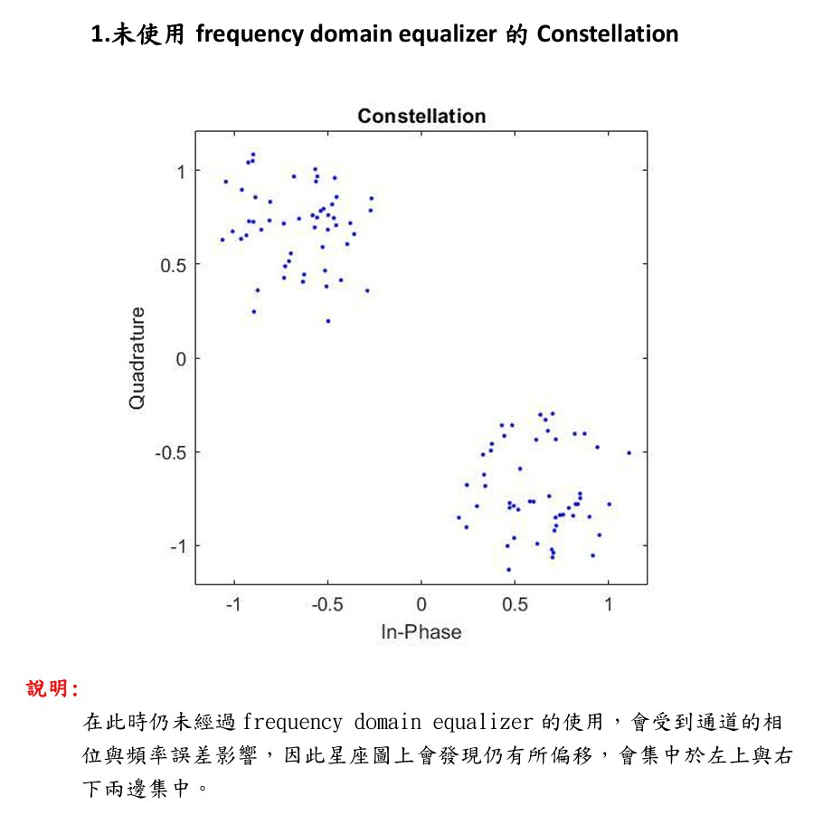
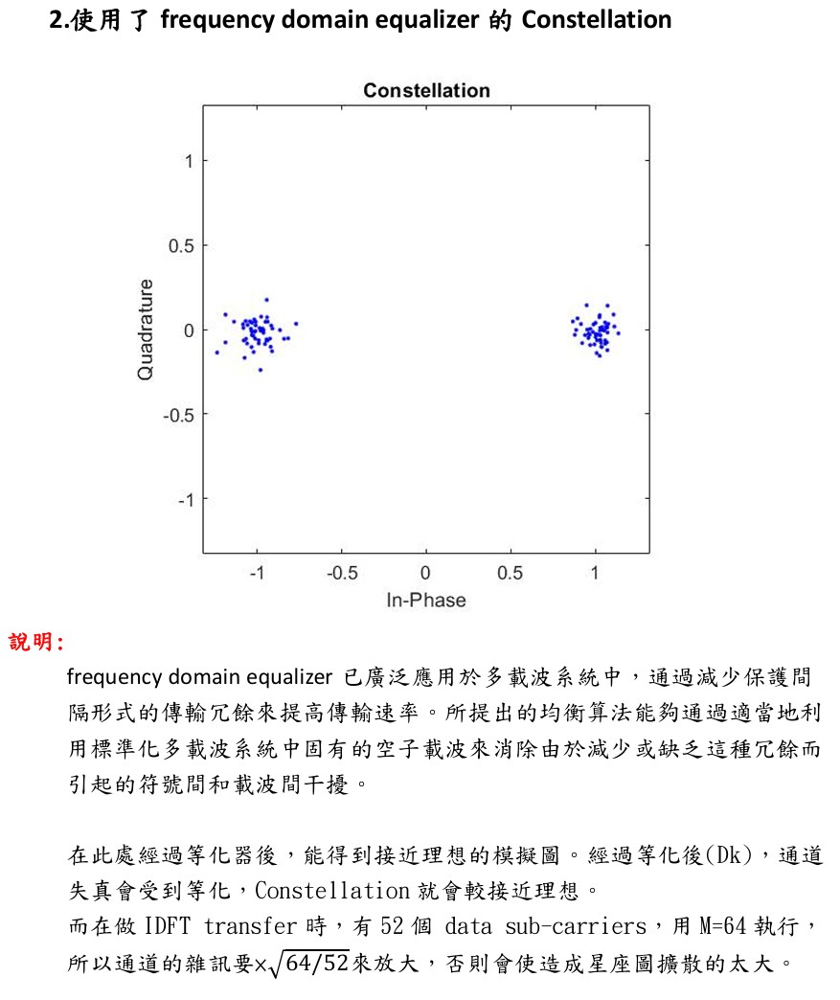

# 📡 行動通訊課程專案 #2

## 題目說明
在這個專案中，我們要透過模擬實現一個 **OFDM 收發機**。  
為了簡化模擬，DAC 與 ADC 被省略，使用的是 **離散時間基頻訊號模型**。  
假設已經達成完美的 **時間與頻率同步**，並且 **通道脈衝響應已知**。  

依據上圖流程，資訊位元會先被調變，再輸入至 $M$ 點 IDFT (IFFT)。  
加入循環字首 (Cyclic Prefix, CP) 之後，訊號 $x[n]$ 被送出。  

## 系統參數
- FFT 點數： $M = 64$  
- 資料子載波數： $52$  
- 循環字首長度： $16$ samples  
- 調變方式： BPSK  
- 子載波索引：  

$$
[7, 8, 9, 10, 11, 12, 13, 14,  
15, 16, 17, 18, 19, 20, 21, 22, 23, 24, 25, 26,  
27, 28, 29, 30, 31, 32, 34, 35, 36, 37, 38, 39,  
40, 41, 42, 43, 44, 45, 46, 47, 48, 49, 50, 51,  
52, 53, 54, 55, 56, 57, 58, 59]
$$

其中，  

$$
D_k \in \{-1, +1\}
$$  

為透過 BPSK 調變後的符號。  

## 接收訊號模型
接收訊號可表示為：  

$$
z[n] = x[n] * h[n] + n[n]
$$

其中：  
- $x[n]$ ：傳送訊號  
- $h[n]$ ：通道響應  
- $n[n]$ ：加性白雜訊 (AWGN)  

---
## (I) 實驗一：星座圖繪製

已知通道脈衝響應：  

$$
\tilde{h}[n] = [0.5 - 0.5j,\; 0,\; 0.15 + 0.12j,\; 0,\; 0,\; -0.1 + 0.05j]
$$  

並且正規化為：  

$$
h[n] = \frac{\tilde{h}[n]}{\text{norm}(\tilde{h}[n])}
$$  

### 實驗要求
- 模擬 **兩個 OFDM 符號週期**，並繪製輸出星座圖 (scatter plot)。  
- 在 **$M$ 點 DFT (FFT) 輸出**處觀察 $Y_k$。  
- 由於有 $2 \times 52 = 104$ 個子載波點，因此星座圖應包含 104 個點。  
- 雜訊條件設定為：  

$$
\frac{E_b}{N_0} = 20 \ \text{dB}
$$  

其中 $\frac{E_b}{N_0}$ 是在 FFT 輸出端量測的。  

### 等化器測試
- 請繪製通過 **頻域等化器 (frequency domain equalizer)** 後的星座圖。  
- 等化器採用 **零迫零 (Zero-Forcing) 準則**：  

$$
\hat{D}_k = \frac{Y_k}{H_k}
$$  

- 注意：需要將時域通道脈衝響應 $h[n]$ 轉換為頻域響應 $H_k$ (透過 FFT)。  
---
## Matlab ver
```matlab
%% Mobile Communication Project #2 - OFDM Simulation
clear; clc; close all;

%% 系統參數
M = 64;                 % FFT 點數
sc = 52;                % 資料子載波數
ofdm_bit = 52;          % 每個 OFDM symbol 的 bits 數 (BPSK = 52)
Nsymbol = 100;          % 模擬的 OFDM 符號數
cp_len = 16;            % 循環字首長度

%% 產生隨機 bits 並做 BPSK 調變
Data = randi([0 1], ofdm_bit * Nsymbol, 1);
dk = 2*Data - 1;                            % BPSK: 0→-1, 1→+1
dk_sym = reshape(dk, sc, Nsymbol);          % Serial → Parallel

%% 插入子載波 (52 個資料子載波)
Dk = zeros(M, Nsymbol);
Dk(7:32,:)  = dk_sym(1:26,:);               % 左 26 個子載波
Dk(34:59,:) = dk_sym(27:52,:);              % 右 26 個子載波

%% IFFT (轉回時域)
IDFT = ifft(Dk, M);

%% 加入循環字首 (CP)
D_cp = [IDFT((M-cp_len+1):M,:); IDFT];      % 前 16 點複製到最前面
x_n = reshape(D_cp, 1, (M+cp_len)*Nsymbol);

%% 通道模型 (多路徑衰落)
h = [0.5-0.5j, 0, 0.15+0.12j, 0, 0, -0.1+0.05j];
h = h ./ norm(h);                           % 正規化
xh = conv(x_n, h);

%% 加入 AWGN (Eb/N0 = 20 dB)
Eb_N0 = 20;
Eb = mean(abs(x_n).^2);
Np = Eb*10^(-Eb_N0/10);
z = awgn(xh(1:end-5), Eb_N0, 'measured');

%% 接收端：移除循環字首 (CP)
receiver = reshape(z, M+cp_len, Nsymbol);
rn = receiver(cp_len+1:end,:);              % 去掉 CP

%% FFT (轉回頻域)
DFT = fft(rn, M);

%% 取出 52 個有效子載波 (等化前)
Yk = [DFT(7:32,:); DFT(34:59,:)];
Yk_serial = reshape(Yk, 1, sc*Nsymbol);

%% 繪製等化前星座圖
figure;
scatterplot(Yk_serial(1:104));              % 取前 2 個 OFDM symbol
title('Constellation Before Equalization');

%% 頻域等化 (Zero-Forcing)
Hn = fft(h, M);
Dk_eq = DFT ./ Hn.';                        % Zero-Forcing: Yk / Hk

%% 取出 52 個子載波 (等化後)
Dk_receiver = [Dk_eq(7:32,:); Dk_eq(34:59,:)];
Dkr_serial = reshape(Dk_receiver, 1, sc*Nsymbol);

%% 繪製等化後星座圖
figure;
scatterplot(Dkr_serial(1:104));
title('Constellation After Equalization');
```
---
## Python Ver
```python
import numpy as np
import matplotlib.pyplot as plt

# ----------------------------
# 系統參數
# ----------------------------
M = 64                  # FFT 點數
sc = 52                 # 資料子載波數
ofdm_bit = 52           # 每個 OFDM symbol bits 數 (BPSK = 52)
Nsymbol = 100           # 模擬 OFDM 符號數
cp_len = 16             # 循環字首長度

# ----------------------------
# 產生隨機 bits 並做 BPSK 調變
# ----------------------------
Data = np.random.randint(0, 2, ofdm_bit * Nsymbol)
dk = 2*Data - 1                         # BPSK: 0→-1, 1→+1
dk_sym = dk.reshape(Nsymbol, sc).T      # Serial → Parallel (sc × Nsymbol)

# ----------------------------
# 插入子載波 (52 個資料子載波)
# ----------------------------
Dk = np.zeros((M, Nsymbol), dtype=complex)
Dk[6:32, :]  = dk_sym[0:26, :]          # 左 26 個子載波 (注意 Python index 從 0 開始)
Dk[33:59, :] = dk_sym[26:52, :]         # 右 26 個子載波

# ----------------------------
# IFFT (轉回時域)
# ----------------------------
IDFT = np.fft.ifft(Dk, n=M, axis=0)

# ----------------------------
# 加入循環字首 (CP)
# ----------------------------
D_cp = np.vstack([IDFT[-cp_len:, :], IDFT])   # 複製最後 cp_len 個樣本到最前面
x_n = D_cp.reshape(-1)                        # 串接成一維向量

# ----------------------------
# 通道模型 (多路徑衰落)
# ----------------------------
h = np.array([0.5-0.5j, 0, 0.15+0.12j, 0, 0, -0.1+0.05j])
h = h / np.linalg.norm(h)                     # 正規化
xh = np.convolve(x_n, h)

# ----------------------------
# 加入 AWGN
# ----------------------------
Eb_N0_dB = 20
Eb = np.mean(np.abs(x_n)**2)                  # 平均 bit 能量
Np = Eb * 10**(-Eb_N0_dB/10)                  # 雜訊功率
noise = np.sqrt(Np/2) * (np.random.randn(len(xh)-5) + 1j*np.random.randn(len(xh)-5))
z = xh[:len(xh)-5] + noise                    # 加入雜訊 (對齊 MATLAB xh(1:end-5))

# ----------------------------
# 接收端：移除循環字首 (CP)
# ----------------------------
receiver = z.reshape(Nsymbol, M+cp_len).T     # 變成 (M+cp_len) × Nsymbol
rn = receiver[cp_len:, :]                     # 去掉 CP (保留 64 點)

# ----------------------------
# FFT (轉回頻域)
# ----------------------------
DFT = np.fft.fft(rn, n=M, axis=0)

# ----------------------------
# 取出 52 個有效子載波 (等化前)
# ----------------------------
Yk = np.vstack([DFT[6:32, :], DFT[33:59, :]])
Yk_serial = Yk.reshape(-1)

# 繪製等化前星座圖
plt.figure()
plt.scatter(np.real(Yk_serial[:104]), np.imag(Yk_serial[:104]))
plt.title('Constellation Before Equalization')
plt.grid(True)

# ----------------------------
# 頻域等化 (Zero-Forcing)
# ----------------------------
Hn = np.fft.fft(h, M)                         # 通道頻率響應
Dk_eq = DFT / Hn[:, np.newaxis]               # Zero-Forcing 等化

# ----------------------------
# 取出 52 個子載波 (等化後)
# ----------------------------
Dk_receiver = np.vstack([Dk_eq[6:32, :], Dk_eq[33:59, :]])
Dkr_serial = Dk_receiver.reshape(-1)

# 繪製等化後星座圖
plt.figure()
plt.scatter(np.real(Dkr_serial[:104]), np.imag(Dkr_serial[:104]))
plt.title('Constellation After Equalization')
plt.grid(True)

plt.show()
```
---
## (I) Result



---
## (II) 實驗二：BER 曲線繪製 (理想通道)

### 實驗要求
- 繪製 **位元錯誤率 (BER) 曲線**。  
- 誤碼率統計需在以下訊雜比條件下進行：  

$$
\frac{E_b}{N_0} = 0, \; 2, \; 4, \; 6, \; 8 \ \text{dB}
$$  

- 通道模型為 **理想通道**：  

$$
h[n] = [1]
$$  

---

## (III) 實驗三：BER 曲線繪製 (多路徑通道)

### 實驗要求
- 繪製 **位元錯誤率 (BER) 曲線**。  
- 誤碼率統計需在以下訊雜比條件下進行：  

$$
\frac{E_b}{N_0} = 0, \; 2, \; 4, \; 6, \; 8 \ \text{dB}
$$  

- 通道模型為 **多路徑通道**，其脈衝響應為：  

$$
h[n] = \frac{\tilde{h}[n]}{\text{norm}(\tilde{h}[n])}
$$  

在這種情況下，因為通道存在衰落與多路徑效應，模擬得到的 BER 曲線會與理論值有明顯差異。


